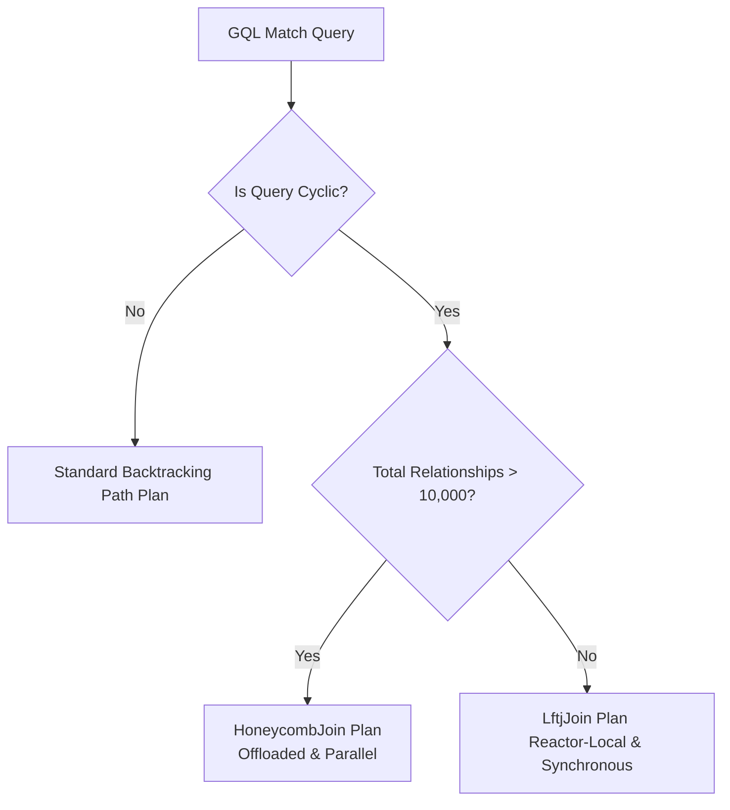

# Worst-Case Optimal Joins (WCOJ) in RageDB

RageDB includes support for **Worst-Case Optimal Joins (WCOJ)** using the **Leapfrog Triejoin (LFTJ)** algorithm. This engine excels at resolving cyclic queries (such as triangles, cliques, and cycles) far more efficiently than traditional binary join algorithms or backtracking path traversers.

---

## 1. What is WCOJ?

Traditional query engines execute joins as a sequence of **binary joins** (e.g., hash joins or loop joins between two tables/relations at a time) or via depth-first backtracking path traversals. For cyclic queries, this approach often produces extremely large intermediate results—sometimes exponentially larger than both the input data and the final output.

**WCOJ** algorithms (like Leapfrog Triejoin) process queries by joining all relations **simultaneously** (multi-way join).
* **AGM Bound**: WCOJ guarantees that the execution time of a query is bounded by the worst-case size of the output (determined by the Atserias-Grohe-Marx bound), regardless of the structure of the input graph.
* **Leapfrog Triejoin (LFTJ)**: LFTJ achieves this bound by:
  1. Sorting and indexing all relations into a unified **Trie index** (Compressed Column Layout or `CoCoIndex`).
  2. Ordering query variables.
  3. Iteratively intersecting the trie levels of all relations sharing a variable using a multi-way **galloping (exponential) seek** intersection.

---

## 2. RageDB Executor Models

RageDB provides two WCOJ executors tailored for different query sizes and workload characteristics:

### A. LftjExecutor (Reactor-Local / Synchronous)
* **When it kicks in**: Automatically selected for cyclic queries where the total relationship count of the involved labels is **`<= 10,000`** (or when `GqlExecutor::force_enable_lftj = true` is set).
* **How it works**: Runs synchronously directly on the calling Seastar reactor thread. It builds the trie indexes and executes the leapfrog multi-way intersection sequentially.
* **Why it's used**: For smaller relation sizes, offloading execution to background threads introduces synchronization and message-passing overhead. The reactor-local executor eliminates this overhead, matching the low latency of pure in-memory execution.

### B. HoneycombExecutor (Parallel / Offloaded)
* **When it kicks in**: Automatically selected for cyclic queries where the total relationship count of the involved labels is **`> 10,000`** (or when `GqlExecutor::force_enable_honeycomb = true` is set).
* **How it works**: Offloads both index construction and leapfrog join processing to standard library background worker threads via Seastar's `alien` execution API. 
* **Why it's used**: Heavy, long-running CPU loops block Seastar's cooperative threads, triggering reactor stalls and hurting the database's responsiveness to other network events. Offloading large joins parallelizes the CPU workload across cores and guarantees **reactor safety** for concurrent client queries.

---

## 3. Trigger & Routing Logic

When a GQL query is parsed and optimized:
1. The **PlanBuilder** checks if the query contains a cycle (via `is_query_cyclic`).
2. If cyclic, it estimates the query size by summing the relationship counts of the labels involved.
3. The optimizer generates either a `LftjJoin` or `HoneycombJoin` plan node based on the relationship count threshold:

### Routing Overrides (for testing and benchmarks)
You can dynamically override this automatic selection using global toggles:
* `GqlExecutor::force_enable_honeycomb = true`: Forces the use of the background parallel Honeycomb executor regardless of size.
* `GqlExecutor::force_enable_lftj = true`: Forces the use of the reactor-local synchronous LFTJ executor regardless of size.
* `GqlExecutor::force_disable_honeycomb = true` and `GqlExecutor::force_disable_lftj = true`: Disables WCOJ completely, falling back to the standard non-WCOJ backtracking traverser.

---

## 4. Performance & Efficiency

On cyclic triangle matches (`(a)-[FRIEND]->(b)-[FRIEND]->(c)-[FRIEND]->(a)`), WCOJ shows massive performance improvements over standard backtracking:

| Executor Type | Query Latency (1,000 node graph) | Result Rows |
| :--- | :--- | :--- |
| **Standard Non-WCOJ** | ~700.0 ms | 999 |
| **LftjExecutor (Reactor-Local)** | **~33.5 ms** (21x faster) | 999 |
| **Honeycomb WCOJ (Parallel)** | **~33.2 ms** (21x faster) | 999 |
| **LFTJ Direct (Bypass)** | **~1.7 ms** | 999 |

* **Standard Backtracking** suffers from intermediate result explosion, expanding all possible 2-hop friendships before filtering down to closed triangles.
* **WCOJ Executors** prune non-matching cycles early at each trie level intersection, keeping execution time proportional to the actual result size.
* **GQL Pipeline Overhead**: The difference between LFTJ Direct (~1.7ms) and the full WCOJ executors (~33ms) represents the overhead of query parsing, schema validation, physical plan building, result formatting, and JSON serialization.
