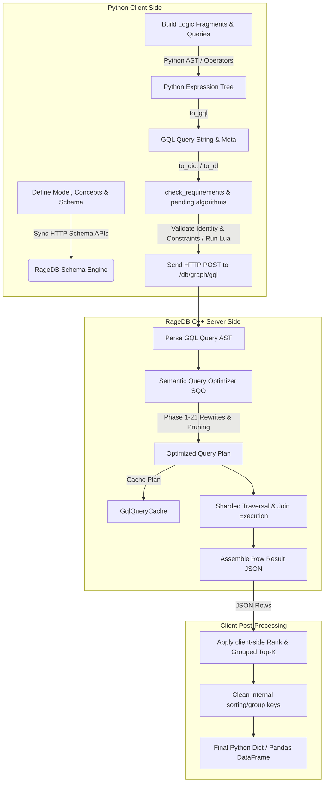
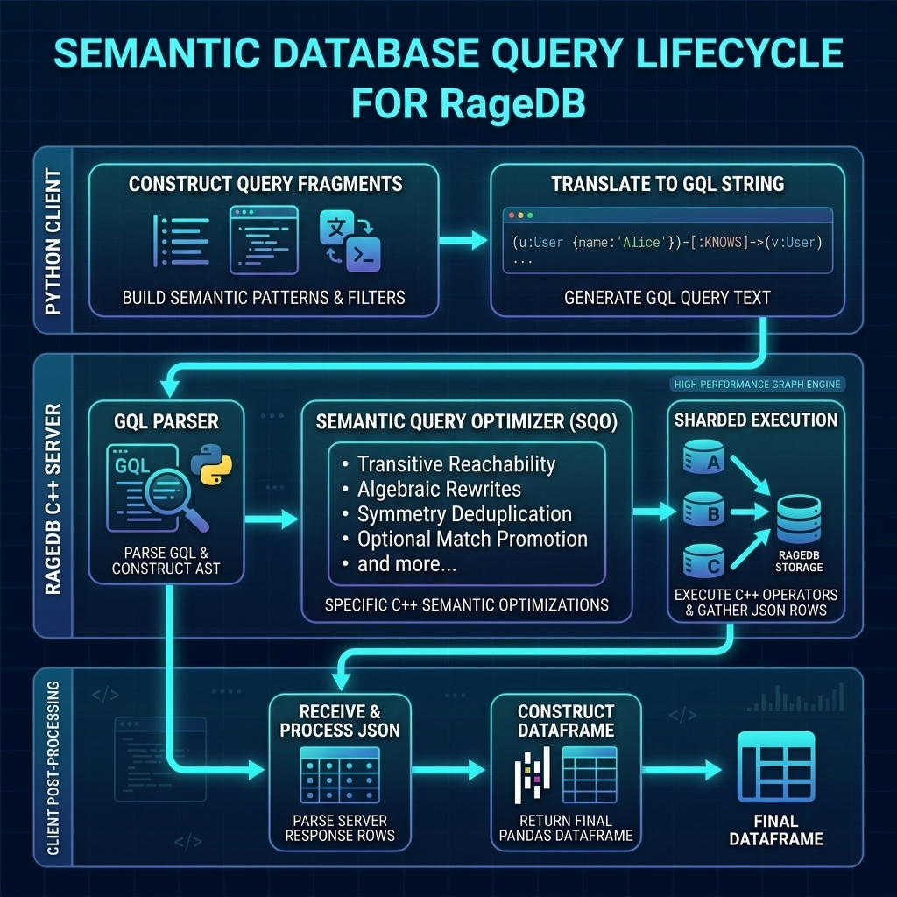

# RageDB Semantic Layer Architecture

This document describes the end-to-end lifecycle of a query in the RageDB Semantic Layer: from defining the Python semantic ontology model and building query logic fragments, to compiling them to Graph Query Language (GQL), running validations, performing server-side Semantic Query Optimization (SQO), executing on shards, and post-processing results.

---

## Architecture Flow Overview

Below is the conceptual pipeline mapping the user's Python declarations down to the optimized sharded database traversal:





---

## 1. Schema & Ontology Declaration (Python API)

The entry point of the semantic layer begins with instantiating a [Model](file:///home/maxdemarzi/ragedb/python/pyragedb/semantics/model.py) instance and defining the graph ontology structure.

> [!NOTE]
> For a detailed guide on how to build, inherit, and validate semantic models in Python, see the [Semantic Modeling Guide (Python)](file:///home/maxdemarzi/ragedb/docs/SEMANTIC_MODELING.md).

### Component Roles & Inheritance
1. **Concepts**: Declared via `m.Concept("Name")`, a [Concept](file:///home/maxdemarzi/ragedb/python/pyragedb/semantics/concept.py) represents a vertex category in the graph. Sibling concepts can inherit properties, relationships, and identity schemes using the `extends` argument (supporting single and multiple inheritance, checked via `inherits_from()`).
2. **Properties**: Declared via `m.Property("Subject has name Type:prop_name")`, defining attribute schemas on nodes.
3. **Relationships**: Declared via `m.Relationship("Source relates to Target:rel_name")`, defining edge schemas.

### Synchronous Schema Setup
When concepts, properties, or relationships are instantiated, the [Model](file:///home/maxdemarzi/ragedb/python/pyragedb/semantics/model.py) class automatically issues HTTP POST requests to the RageDB server's `/schema/nodes` and `/schema/relationships` endpoints (see [API.md](file:///home/maxdemarzi/ragedb/docs/API.md)). This guarantees that node labels, relationship types, and property type definitions (booleans, integers, doubles, strings) are registered in the virtual catalog before data insert or query begins.

---

## 2. Logic Expression Construction (Python AST)

Queries and views are constructed in Python using a Fluent API that builds an Abstract Syntax Tree (AST) representing logic fragments.

*   **Chaining Filters & Projections**: `m.where()` and `m.select()` return [Fragment](file:///home/maxdemarzi/ragedb/python/pyragedb/semantics/fragment.py) objects.
*   **Operator Overloading**: Python operators are overloaded on [AttributeRef](file:///home/maxdemarzi/ragedb/python/pyragedb/semantics/concept.py) to yield logical and arithmetic expressions:
    *   Comparison operators (`==`, `!=`, `<`, `<=`, `>`, `>=`) return `Condition` objects.
    *   Logical operators (`&`, `|`, `~`) or helpers (`not_()`, `union()`) return `AndCondition`, `OrCondition`, `NotCondition`, or `CombinedFragment`.
    *   Arithmetic operators (`+`, `-`, `*`, `/`) return `ArithmeticExpr`.
*   **Standard Library Wrappers**: Specialized modules in `pyragedb.semantics.std` (like `strings`, `math`, `datetime`, and `aggregates`) build `FunctionCallExpr` and `AggregateBuilder` nodes.
*   **Grouping & Windowing**: Aggregates can specify grouping using `.per(*concepts)` and filters via `.where(*conditions)`. Ranking and Top-K use `RankBuilder` and `TopBuilder` nodes.

---

## 3. GQL Translation & Compilation (`to_gql()`)

To run queries against the graph database, the Python client compiles the expression tree into a standard GQL query string inside [to_gql()](file:///home/maxdemarzi/ragedb/python/pyragedb/semantics/fragment.py#L354).

The compilation follows these sub-steps:
1.  **Reference Collection**: Recursively traverses the conditions and projections to discover all referenced concepts, concept variables (`ConceptRef`), and relationship references (`AttributeRefRef`).
2.  **Variable Allocation**: Generates unique, short, lowercase variables for each referenced concept (e.g., `person` for `Person`, or preserves manual reference aliases such as `o1`, `s1`).
3.  **Pattern Assembly**: Determines the graph structure topology from attribute parents. Relationship paths are compiled into GQL edge expressions (e.g., `(order)-[:SHIPPED_BY]->(carrier:Carrier)`), while property attributes map to dot notation (e.g., `person.age`).
4.  **Filter Translation**: Compiles comparisons, logical chains, and library functions into GQL `WHERE` expressions (e.g., mapping `strings.startswith(x, y)` to `x STARTS WITH y`, or `math.clip` to a GQL `CASE WHEN` clause).
5.  **Metadata Injection for Post-Processing**: Operations not natively supported in standard GQL (such as grouped ranking and grouped top-K) inject temporary hidden variables (e.g., `__sort_key_0`, `__group_key_1`) into the `RETURN` projection and store sorting/grouping metadata in `self._post_process_meta`.
6.  **DDL Generation for Views**: Calling `m.define(Concept, Fragment)` generates a virtual DDL statement:
    ```gql
    CREATE VIEW ViewName AS MATCH ... WHERE ... RETURN ...
    ```

---

## 4. Validation & Pre-execution Hooks

Before transmitting the query to the server, the client executes safety validations and runs queued background computations:

### A. Identity and Invariant Verification
During `to_dict()` or `to_df()`, the client calls [check_requirements()](file:///home/maxdemarzi/ragedb/python/pyragedb/semantics/model.py#L509):
*   **Identity Scheme Verification**: Validates uniqueness requirements for each concept's identity scheme keys (by executing a `MATCH` checking for sibling nodes carrying identical properties/relations, respecting inheritance boundaries).
*   **User Invariants**: Checks model-wide and concept-scoped `require()` rules. It executes the negative validation query (e.g., `MATCH WHERE NOT (condition) RETURN ...`). If any violating records are returned from the database, the client halts execution and raises a `ValueError`.

### B. Graph Algorithm Pre-execution
If a query relies on graph metrics (e.g., `pagerank`, `weakly_connected_component`, `leiden`, or `jaccard_similarity`) assigned as properties (e.g., `graph.Node.rank = graph.pagerank(...)`), the client:
1.  Registers the dependencies inside `_pending_graph_algorithms`.
2.  Ensures property/relationship schemas exist in the DB.
3.  Translates the algorithm parameters into a Lua execution script.
4.  Posts the script to the database's `/lua` endpoint to run traversals, compute metrics, and write them directly back to graph properties *before* the GQL query executes.

---

## 5. Server-side Parsing & Semantic Query Optimization (C++)

Once the compiled GQL query string is received by the C++ server via `/db/{graph}/gql`, it is parsed into an AST. If the query does not contain bypass hints (`NO_SEMANTIC` or `/* no_semantic */`), it is passed through the **Semantic Query Optimizer (SQO)**, consisting of 21 specialized C++ passes (configured in [src/gql/optimizer](file:///home/maxdemarzi/ragedb/src/gql/optimizer)):

1.  **Phase 1: Range Contradiction Pruning** ([ContradictionPruner.cpp](file:///home/maxdemarzi/ragedb/src/gql/optimizer/ContradictionPruner.cpp)): Identifies whether a variable's bounds (e.g., `age = -5`) conflict with impossible regions defined in check constraints, setting `no_op = true` if unsatisfiable.
2.  **Phase 2: Join Elimination** ([JoinEliminator.cpp](file:///home/maxdemarzi/ragedb/src/gql/optimizer/JoinEliminator.cpp)): Uses mandatory schema constraints to prune redundant edge traversal hops where target nodes are not projected or filtered.
3.  **Phase 3: Poset Relational Cycle Pruning** ([ContradictionPruner.cpp](file:///home/maxdemarzi/ragedb/src/gql/optimizer/ContradictionPruner.cpp)): Builds inequality graphs and runs Floyd-Warshall cycle detection to catch impossible loops (e.g., `a.val < b.val AND b.val < a.val`).
4.  **Phase 4: Algebraic Sum Rewrite** ([AlgebraicRewriter.cpp](file:///home/maxdemarzi/ragedb/src/gql/optimizer/AlgebraicRewriter.cpp)): Pulls constants and grouping keys out of summation operators ($\sum(A \times B) = A \times \sum B$) using semiring distributivity.
5.  **Phase 4.5: Algebraic Path Count Rewrite** ([AlgebraicRewriter.cpp](file:///home/maxdemarzi/ragedb/src/gql/optimizer/AlgebraicRewriter.cpp)): Translates exponential multi-hop path expansions $O(|V| \cdot d^k)$ into linear-time degree propagation $O(k \cdot |E|)$ when intermediate vertices are only aggregated.
6.  **Phase 5: Cardinality Short-Circuiting** ([CardinalityShortCircuiter.cpp](file:///home/maxdemarzi/ragedb/src/gql/optimizer/CardinalityShortCircuiter.cpp)): Uses registered $N$-to-1/1-to-1 bounds to cap outdegree traversals early.
7.  **Phase 6: Subsumption / Query Containment** ([SubsumptionPruner.cpp](file:///home/maxdemarzi/ragedb/src/gql/optimizer/SubsumptionPruner.cpp)): Prunes redundant isomorphic path patterns originating from a shared node variable when one path's constraints are subsetted by another.
8.  **Phase 7: Composite Domain Constraint Reasoning** ([DomainConstraintReasoner.cpp](file:///home/maxdemarzi/ragedb/src/gql/optimizer/DomainConstraintReasoner.cpp)): Combines query filter logic with negated check constraints in CNF, checking satisfiability using a DPLL(T) SAT/SMT solver.
9.  **Phase 8: Transitive DAG Reachability** ([TransitiveReachabilityPruner.cpp](file:///home/maxdemarzi/ragedb/src/gql/optimizer/TransitiveReachabilityPruner.cpp)): Truncates variable-length taxonomy traversals early if start and end concepts are unreachable in the class hierarchy DAG.
10. **Phase 9: Functional Dependency Rewriting** ([FunctionalDependencyPruner.cpp](file:///home/maxdemarzi/ragedb/src/gql/optimizer/FunctionalDependencyPruner.cpp)): Rewrites property aggregations (e.g., `count(b.state)`) into faster property-free aggregations (`count(*)`) when the property is functionally determined by a grouping key.
11. **Phase 10: Automorphic Symmetry Deduplication** ([AutomorphicSymmetryOptimizer.cpp](file:///home/maxdemarzi/ragedb/src/gql/optimizer/AutomorphicSymmetryOptimizer.cpp)): Breaks cyclic automorphism symmetries in counting queries (e.g., triangles) by injecting canonical ordering constraints (`v1 < v2 < v3`) and a multiplication factor of 6.
12. **Phase 11: Schema Path Unsatisfiability Pruning** ([SchemaReachabilityPruner.cpp](file:///home/maxdemarzi/ragedb/src/gql/optimizer/SchemaReachabilityPruner.cpp)): Validates query path transitions against the allowed relationship types in the schema catalog, setting `no_op = true` if structurally impossible.
13. **Phase 12: Optional Match Promotion** ([OptionalMatchPromoter.cpp](file:///home/maxdemarzi/ragedb/src/gql/optimizer/OptionalMatchPromoter.cpp)): Promotes optional matches to inner matches if filters contain null-rejecting predicates on optionally matched variables.
14. **Phase 13: Degree-Constraint Pruning** ([DegreeConstraintPruner.cpp](file:///home/maxdemarzi/ragedb/src/gql/optimizer/DegreeConstraintPruner.cpp)): Rewrites pattern size expressions like `size((a)-[:FRIEND]->())` into virtual degree property lookups (`a._deg_a_FRIEND_OUT`) fetched directly from node metadata.
15. **Phase 14: Unique Constraint Join Elimination** ([UniqueJoinEliminator.cpp](file:///home/maxdemarzi/ragedb/src/gql/optimizer/UniqueJoinEliminator.cpp)): Prunes optional matches along relationships constrained to be unique when the target node is unreferenced elsewhere in the query.
16. **Phase 15: Limit & Top-K Pushdown** ([LimitPushdownOptimizer.cpp](file:///home/maxdemarzi/ragedb/src/gql/optimizer/LimitPushdownOptimizer.cpp)): Propagates global `LIMIT` boundaries into individual match and traversal steps to allow early traversal termination.
17. **Phase 16: Transitive Filter Propagation** ([TransitiveFilterPropagator.cpp](file:///home/maxdemarzi/ragedb/src/gql/optimizer/TransitiveFilterPropagator.cpp)): Walks the query filter AST to locate node variable equalities, building equivalence partitions and copying/propagating filters across all variables in the same partition.
18. **Phase 17: Relationship Contradiction Pruning** ([EdgeContradictionPruner.cpp](file:///home/maxdemarzi/ragedb/src/gql/optimizer/EdgeContradictionPruner.cpp)): Scans relationship pattern property filters and checks them against database check constraints to short-circuit unsatisfiable paths.
19. **Phase 18: Anti-Semi-Join Promotion** ([AntiSemiJoinPromoter.cpp](file:///home/maxdemarzi/ragedb/src/gql/optimizer/AntiSemiJoinPromoter.cpp)): Identifies `OPTIONAL MATCH` blocks filtered with `IS NULL` on the target variable and converts them to anti-semi-joins (`WHERE NOT EXISTS { MATCH ... }`).
20. **Phase 19: Equality Join Elimination** ([EqualityJoinEliminator.cpp](file:///home/maxdemarzi/ragedb/src/gql/optimizer/EqualityJoinEliminator.cpp)): Merges duplicate variables in match pattern paths that traverse identical relationship types and are constrained by targets equality.
21. **Phase 20: Disjoint Concept Path Pruning** ([DisjointConceptPruner.cpp](file:///home/maxdemarzi/ragedb/src/gql/optimizer/DisjointConceptPruner.cpp)): Identifies variable-length path taxonomy queries between disjoint concepts and short-circuits them early.
22. **Phase 21: Direction Swap Optimization** ([DirectionSwapOptimizer.cpp](file:///home/maxdemarzi/ragedb/src/gql/optimizer/DirectionSwapOptimizer.cpp)): Rewrites pattern traversal directions to start at the variable with the lowest size/selectivity estimate based on unique and property index filters.

### Query Cache Integration
To prevent compilation and optimization passes from running on every request, the pre-optimized AST is cached in the thread-local `GqlQueryCache`. Hot queries skip parsing and optimization entirely, going straight to execution. The cache is automatically flushed on reactor threads when catalog schema changes occur (e.g., `CREATE CONSTRAINT` or `DROP CONSTRAINT`).

For a detailed review of SQO mathematics and benchmarks, see [SEMANTIC_OPTIMIZER.md](file:///home/maxdemarzi/ragedb/docs/SEMANTIC_OPTIMIZER.md).

---

## 6. Sharded Execution & Client-side Post-processing

### Execution
The optimized plan is executed across physical partitions using the Seastar asynchronous reactor framework. Vertices and relationships are traversed in parallel across shards.

### Client-side Post-processing
Once the JSON response is returned from RageDB, the Python client completes the query using [to_dict()](file:///home/maxdemarzi/ragedb/python/pyragedb/semantics/fragment.py#L798):

1.  **Ranking**: If ranking metadata exists, the client groups the rows by group-by keys, sorts them stably by sort keys (descending/ascending, correctly handling `None` values), computes the dense/standard rank values, and writes them to the designated rank alias column.
2.  **Grouped Top-K Filtering**: If grouped top-K metadata is present, it groups the rows, sorts them within each group, and slices the collection up to the specified limit.
3.  **Hidden Field Cleanup**: Filters out internal metadata keys (e.g., variables starting with `__sort_key_` or `__group_key_`) so the final return set contains only the projected columns requested by the user.
4.  **Export**: Returns the clean list of dict rows or translates them into a Pandas DataFrame (`to_df()`).

---

## 7. Concrete End-to-End Walkthrough

Here is a step-by-step walkthrough of how a Python model with check constraints and nested views is compiled, translated, and optimized.

### A. Python Model, Constraints, and Nested Views Definition

We define a logistics model with constraints ensuring data validity:

```python
from pyragedb.semantics import Model, String, Integer

m = Model("logistics_model")

# 1. Declare Concepts
Order = m.Concept("Order")
Shipment = m.Concept("Shipment")
Carrier = m.Concept("Carrier")

# 2. Register Properties & Relationships
m.Property(f"{Order} has id {Integer:id}")
m.Property(f"{Order} has created_at {Integer:created_at}")
m.Property(f"{Order} has promised_date {Integer:promised_date}")
Order.shipments = m.Relationship(f"{Order} has shipment {Shipment:shipment}")

m.Property(f"{Shipment} has shipped_at {Integer:shipped_at}")
Shipment.shipped_by = m.Relationship(f"{Shipment} shipped by {Carrier:shipped_by}")

m.Property(f"{Carrier} has name {String:name}")

# 3. Register Constraints / Invariants
# - Order promised date must be greater than or equal to its creation date
Order.require(Order.promised_date >= Order.created_at, name="OrderDateValidity")

# 4. Define Nested Views
# View 1: LateShipment (any shipment where actual shipped_at exceeds order promised_date)
LateShipment = m.Concept("LateShipment")
m.define(LateShipment, m.where(
    Order.shipments(Shipment),
    Shipment.shipped_at > Order.promised_date
))

# View 2: DHLLateShipment (nested view referencing LateShipment + filtering on DHL carrier)
DHLLateShipment = m.Concept("DHLLateShipment")
m.define(DHLLateShipment, m.where(
    LateShipment,
    LateShipment.shipment.shipped_by.name == "DHL"
))
```

### B. User Query Construction

A client constructs a query that selects late DHL shipments, adding an additional filter asking for orders where `created_at > promised_date`:

```python
# Select order IDs for DHL late shipments that have invalid date sequences
q = m.where(DHLLateShipment)\
     .where(DHLLateShipment.order.created_at > DHLLateShipment.order.promised_date)\
     .select(DHLLateShipment.order.id)
```

### C. Step 1: Python AST Construction

In memory, Python represents `q` as an expression tree:
*   A root [Fragment](file:///home/maxdemarzi/ragedb/python/pyragedb/semantics/fragment.py) containing:
    *   `projections`: `[AttributeRef(DHLLateShipment.order.id)]`
    *   `conditions`:
        1.  `ConceptRef(DHLLateShipment)` (the view definition node)
        2.  `Condition("gt", AttributeRef(DHLLateShipment.order.created_at), AttributeRef(DHLLateShipment.order.promised_date))`

### D. Step 2: GQL Compilation (`to_gql()`)

When `q.to_gql()` is called, the compiler expands the nested definitions:
1.  **Reference Gathering**: The compiler resolves `DHLLateShipment` which resolves to `LateShipment` with a join to `Carrier`. `LateShipment` further expands to a join between `Order` and `Shipment`.
2.  **GQL Query Assembly**: The final compiled query string is output:
    ```gql
    MATCH (order:Order)-[:SHIPMENT]->(shipment:Shipment)-[:SHIPPED_BY]->(carrier:Carrier)
    WHERE shipment.shipped_at > order.promised_date 
      AND carrier.name = 'DHL' 
      AND order.created_at > order.promised_date
    RETURN order.id
    ```

### E. Step 3: Server-side Semantic Query Optimization (C++)

When the query reaches the C++ optimizer, it undergoes optimization passes:

#### Pass 1: Range Contradiction Pruning
*   The optimizer loads registered constraints, including `OrderDateValidity` (which dictates that for any `Order`, `promised_date >= created_at`).
*   In the query, we have a filter: `order.created_at > order.promised_date`.
*   [ContradictionPruner.cpp](file:///home/maxdemarzi/ragedb/src/gql/optimizer/ContradictionPruner.cpp) evaluates the interval overlap:
    $$\text{Valid Region: } [created\_at, +\infty)$$
    $$\text{Query Region: } (-\infty, created\_at)$$
    $$\text{Intersection: } \emptyset$$
*   Because the query condition is mathematically impossible under the registered constraints, the pruner marks `query.no_op = true` and short-circuits traversal.
*   **Result**: The query returns `[]` immediately without querying shards or performing joins.

#### Pass 2: Alternative Execution (Without Contradiction)
If the contradiction filter was omitted, the query would be:
```gql
MATCH (order:Order)-[:SHIPMENT]->(shipment:Shipment)-[:SHIPPED_BY]->(carrier:Carrier)
WHERE shipment.shipped_at > order.promised_date AND carrier.name = 'DHL'
RETURN order.id
```
If we also had a schema rule stating that *every* shipment must have a carrier, and we queried without filtering or projecting the `carrier` (e.g. searching shipments generally), **Phase 2 (Join Elimination)** would prune the `SHIPPED_BY` join entirely, executing only:
```gql
MATCH (order:Order)-[:SHIPMENT]->(shipment:Shipment)
WHERE shipment.shipped_at > order.promised_date
RETURN order.id
```
This saves remote network hops to `Carrier` vertices across the cluster shards.

---

### Walkthrough Example 2: Algebraic Path Count Rewrite (Phase 4.5)

This example illustrates how multi-hop path traversals are optimized when intermediate and final nodes are only aggregated.

#### Python Query
```python
# Count friends-of-friends-of-friends (3 hops) per person
q = m.select(
    Person.id,
    aggregates.count(Person.friends.friends.friends).per(Person).alias("fofof_cnt")
)
```

#### Step 1: Python AST Construction
*   A projection containing the `Person.id` and an `AggregateBuilder` node.
*   The `AggregateBuilder` carries `op="count"`, a target path defined by `AttributeRef` chain `Person -> friends -> friends -> friends`, and groups by `Person`.

#### Step 2: GQL Compilation (`to_gql()`)
The compiled GQL query represents a standard 3-hop traversal:
```gql
MATCH (person:Person)-[:FRIEND]->(f1:Person)-[:FRIEND]->(f2:Person)-[:FRIEND]->(f3:Person)
RETURN person.id, count(f3) AS fofof_cnt
```

#### Step 3: Server-side Semantic Query Optimization (C++)
*   **Optimization Pass**: [AlgebraicRewriter.cpp](file:///home/maxdemarzi/ragedb/src/gql/optimizer/AlgebraicRewriter.cpp) (`Phase 4.5: Algebraic Path Count Rewrite`) inspects the AST. It detects that the path expands across intermediate nodes (`f1`, `f2`) to a target `f3`, and all these variables are untouched outside of the `count()` aggregation.
*   **Rewrite**: The optimizer replaces the traversal joins with a single-node match `(person:Person)` and binds it to the `AlgebraicPathCountJoin` operator.
*   **Execution**: Instead of exponentially traversing paths ($O(|V| \cdot d^3)$), the engine executes Seastar-peered iterative local degree updates:
    $$\mathbf{v}_m[u] = \sum_{v \in Neigh(u)} \mathbf{v}_{m-1}[v]$$
    This scales linearly with edges $O(3 \cdot |E|)$, cutting latencies from 1.4 seconds to 147 milliseconds.

---

### Walkthrough Example 3: Automorphic Graph Symmetry Deduplication (Phase 10)

This example demonstrates how symmetric cycle patterns (like triangles) are pruned by injecting ordering constraints.

#### Python Query
```python
# Find homogeneous friendship triangles and count total unique occurrences
q = m.where(
    Person.friends(Friend1),
    Friend1.friends(Friend2),
    Friend2.friends(Person)
).select(aggregates.count(Person))
```

#### Step 1: Python AST Construction
*   A query fragment containing a cyclic condition loop (`Person -> Friend1 -> Friend2 -> Person`) and a count projection.

#### Step 2: GQL Compilation (`to_gql()`)
The compiled GQL represents a cyclic friendship loop:
```gql
MATCH (person:Person)-[:FRIEND]->(friend1:Person)-[:FRIEND]->(friend2:Person)-[:FRIEND]->(person)
RETURN count(person)
```

#### Step 3: Server-side Semantic Query Optimization (C++)
*   **Optimization Pass**: [AutomorphicSymmetryOptimizer.cpp](file:///home/maxdemarzi/ragedb/src/gql/optimizer/AutomorphicSymmetryOptimizer.cpp) (`Phase 10: Automorphic Symmetry Deduplication`) identifies the homogeneous triangle cycle pattern.
*   **Rewrite**: A cycle of length 3 has 6 symmetric traversal configurations (permutations of the vertices). To break the symmetry, the optimizer defines a canonical sorting order by comparing variable names and injects the following filters into the query `WHERE` clause:
    ```gql
    WHERE person < friend1 AND friend1 < friend2
    ```
    It then sets the server metadata variable `query.count_multiplication_factor = 6`.
*   **Execution**: The sharded executor traverses only a single canonical representation of each triangle. Upon returning, the count is multiplied by 6, pruning 5/6ths of the traversal state space.

---

### Walkthrough Example 4: Subsumption / Query Containment Pruning (Phase 6)

This walkthrough shows how redundant relationship scans are pruned when their filters are subsumed by other query paths.

#### Python Query
```python
# Find parents who have a child older than 18 AND a child older than 5
q = m.where(Person.children(Child1), Child1.age > 18)\
     .where(Person.children(Child2), Child2.age > 5)\
     .select(Person.name)
```

#### Step 1: Python AST Construction
*   A query fragment with two separate relationship traversals (`Person -> Child1` and `Person -> Child2`) along with range comparison conditions.

#### Step 2: GQL Compilation (`to_gql()`)
The compiled GQL query performs two separate matches:
```gql
MATCH (person:Person)-[:CHILD]->(child1:Person)
MATCH (person)-[:CHILD]->(child2:Person)
WHERE child1.age > 18 AND child2.age > 5
RETURN person.name
```

#### Step 3: Server-side Semantic Query Optimization (C++)
*   **Optimization Pass**: [SubsumptionPruner.cpp](file:///home/maxdemarzi/ragedb/src/gql/optimizer/SubsumptionPruner.cpp) (`Phase 6: Subsumption / Query Containment`) compares the two matches.
*   **Analysis**:
    1.  Both match structures are isomorphic paths originating from `person` traversing `[:CHILD]`.
    2.  `child2` is a dead-end variable (not projected, sorted, or referenced in further joins/filters).
    3.  The filter `child1.age > 18` is a subset of the filter `child2.age > 5`. Because any child older than 18 is mathematically guaranteed to be older than 5, the path for `child1` completely subsumes the path for `child2`.
*   **Rewrite**: The optimizer prunes the second match and its redundant filter completely, rewriting the query to:
    ```gql
    MATCH (person:Person)-[:CHILD]->(child1:Person)
    WHERE child1.age > 18
    RETURN person.name
    ```
*   **Execution**: The engine executes only one traversal pass per parent, yielding a 34.6x speedup.

> [!IMPORTANT]
> **Cypher Path Node Binding & Uniqueness**:
> You might wonder if this rewrite changes the query's meaning from "has two children (one > 18, one > 5)" to "has one child (> 18)".
> Under standard GQL/Cypher semantics, variables in different MATCH clauses (or patterns) **can bind to the same vertex** unless a distinct inequality filter is specified. 
> 
> Consequently, if a parent has only one child aged 20, both conditions are satisfied by that single child (since 20 > 18 and 20 > 5). Thus, the unoptimized and optimized queries are mathematically equivalent and return the identical result set.
> 
> If the query was intended to require two *different* children, the user would write:
> ```python
> q = m.where(Person.children(Child1), Child1.age > 18)\
>      .where(Person.children(Child2), Child2.age > 5)\
>      .where(Child1 != Child2)\
>      .select(Person.name)
> ```
> In this case, `child2` is referenced in the filter `child1 != child2`, making it no longer a "dead-end" variable. The subsumption pruner detects this reference and does **not** prune the second MATCH, preserving the requirement of two distinct child node traversals.

---

### Walkthrough Example 5: Highly Complex Nested Views & Multi-Phase Optimizations

This example shows how a deep tree of nested views and constraints compiles into a multi-join query, which the C++ optimizer then simplifies using range contradiction checks, referential join pruning, algebraic factorization, and functional dependency rules.

#### A. Schema, Constraints, and Deep Nested Views Setup

We define a database for order tracking, payment verification, and supplier audits:

```python
from pyragedb.semantics import Model, String, Integer, Float

m = Model("audit_model")

# 1. Base Concepts
Customer = m.Concept("Customer", identify_by={"id": Integer})
Order = m.Concept("Order")
Payment = m.Concept("Payment")
Item = m.Concept("Item")
Supplier = m.Concept("Supplier")

# 2. Properties and Relationships
m.Property(f"{Customer} has name {String:name}")
m.Property(f"{Customer} has segment {String:segment}")
Customer.orders = m.Relationship(f"{Customer} placed {Order:placed_order}")

m.Property(f"{Order} has total_amount {Float:total_amount}")
m.Property(f"{Order} has order_date {Integer:order_date}")
m.Property(f"{Order} has promised_delivery_date {Integer:promised_delivery_date}")
m.Property(f"{Order} has delivery_date {Integer:delivery_date}")
Order.payments = m.Relationship(f"{Order} has payment {Payment:payment}")
Order.items = m.Relationship(f"{Order} contains {Item:item}")

m.Property(f"{Item} has price {Float:price}")
Item.supplied_by = m.Relationship(f"{Item} supplied by {Supplier:supplied_by}")

m.Property(f"{Supplier} has region {String:region}")

# 3. Check Constraints (Schema Invariants)
# - Delivery promised date must be >= order date
Order.require(Order.promised_delivery_date >= Order.order_date, name="ValidOrderDates")
# - Referential Constraint: Every order must link to a Payment node
Order.require(Order.payments, name="MandatoryPayment")

# 4. Nested Logic / View Declarations
# View 1: PremiumCustomer (Gold/Platinum segments)
PremiumCustomer = m.Concept("PremiumCustomer")
m.define(PremiumCustomer, m.where(
    Customer,
    (Customer.segment == "Gold") | (Customer.segment == "Platinum")
))

# View 2: HighValueItem (item price > 1000)
HighValueItem = m.Concept("HighValueItem")
m.define(HighValueItem, m.where(
    Item,
    Item.price > 1000
))

# View 3: DelayedDelivery (delivery exceeds promised date)
DelayedDelivery = m.Concept("DelayedDelivery")
m.define(DelayedDelivery, m.where(
    Order,
    Order.delivery_date > Order.promised_delivery_date
))

# View 4 (Deep Nested View): UrgentSupplierAudit
# Connects PremiumCustomer -> DelayedDelivery -> HighValueItem -> Supplier
UrgentSupplierAudit = m.Concept("UrgentSupplierAudit")
m.define(UrgentSupplierAudit, m.where(
    PremiumCustomer,
    PremiumCustomer.orders(DelayedDelivery),
    DelayedDelivery.items(HighValueItem),
    HighValueItem.supplied_by(Supplier)
))
```

#### B. User Query Construction

The client issues a query requesting the sum of audit penalty values (15% of item price) for premium customers who had delayed deliveries from North-region suppliers, grouped by customer ID and name.

```python
# Group by customer and compute audit penalty (15% of price)
q = m.where(UrgentSupplierAudit)\
     .where(UrgentSupplierAudit.supplier.region == "North")\
     .select(
         UrgentSupplierAudit.customer.id,
         UrgentSupplierAudit.customer.name,
         aggregates.sum(UrgentSupplierAudit.item.price * 0.15).alias("audit_penalty")
     )
```

#### C. Step 1: GQL Compilation (`to_gql()`)

The Python compiler walks the nested view hierarchy:
`UrgentSupplierAudit` $\to$ `PremiumCustomer` & `DelayedDelivery` & `HighValueItem` $\to$ `Customer` & `Order` & `Item` & `Supplier`.
The schema requirement `MandatoryPayment` also dictates that the `Order` maps to `Payment`.

The compiler outputs this single compiled GQL query string:
```gql
MATCH (customer:Customer)-[:PLACED_ORDER]->(order:Order)-[:CONTAINS]->(item:Item)-[:SUPPLIED_BY]->(supplier:Supplier)
MATCH (order)-[:PAYMENT]->(payment:Payment)
WHERE (customer.segment = 'Gold' OR customer.segment = 'Platinum')
  AND order.delivery_date > order.promised_delivery_date
  AND item.price > 1000
  AND supplier.region = 'North'
RETURN customer.id, customer.name, sum(item.price * 0.15) AS audit_penalty
```

#### D. Step 2: C++ Server-side Optimization Passes

When this multi-join query is compiled on the server, several SQO passes run in parallel:

1.  **Phase 2: Join Elimination** ([JoinEliminator.cpp](file:///home/maxdemarzi/ragedb/src/gql/optimizer/JoinEliminator.cpp)):
    *   The optimizer inspects the query pattern. It sees a join to `(payment:Payment)`.
    *   The variable `payment` is never projected, sorted, or filtered.
    *   The registered catalog constraint `MandatoryPayment` guarantees that every `Order` node has an outgoing `PAYMENT` edge.
    *   **Action**: The optimizer prunes the payment MATCH pattern completely, saving remote node traversals.
2.  **Phase 4: Algebraic Sum Rewrite** ([AlgebraicRewriter.cpp](file:///home/maxdemarzi/ragedb/src/gql/optimizer/AlgebraicRewriter.cpp)):
    *   The sum expression contains a constant multiplier: `sum(item.price * 0.15)`.
    *   **Action**: Pushes the constant factor outside the aggregation: `0.15 * sum(item.price)`. The sharded executor will perform addition on raw prices first, executing the multiplication once per grouping bucket.
3.  **Phase 9: Functional Dependency Rewriting** ([FunctionalDependencyPruner.cpp](file:///home/maxdemarzi/ragedb/src/gql/optimizer/FunctionalDependencyPruner.cpp)):
    *   The query selects `customer.id` and `customer.name`.
    *   The catalog has registered `id` as the customer identifier (`Customer.id`). Because `id -> name` represents a functional dependency, the optimizer registers that `customer.name` is functionally determined by `customer.id`.
    *   **Action**: It removes `customer.name` from the internal grouping list, sorting and partitioning rows using only `customer.id`. The name attribute is resolved once per final output group rather than once per traversed item.

#### E. Step 3: Final Optimized Query Plan

The optimized plan executed by the server represents this simplified GQL execution:
```gql
MATCH (customer:Customer)-[:PLACED_ORDER]->(order:Order)-[:CONTAINS]->(item:Item)-[:SUPPLIED_BY]->(supplier:Supplier)
WHERE (customer.segment = 'Gold' OR customer.segment = 'Platinum')
  AND order.delivery_date > order.promised_delivery_date
  AND item.price > 1000
  AND supplier.region = 'North'
RETURN customer.id, customer.name, 0.15 * sum(item.price) AS audit_penalty
```

**Key structural changes from the unoptimized compiled GQL query**:
1.  **Pruned Payment Join**: The join path `MATCH (order)-[:PAYMENT]->(payment:Payment)` was deleted because `payment` was identified as a dead-end node whose presence is guaranteed by the `MandatoryPayment` constraint.
2.  **Factored Out Constant**: The multiplication operation `* 0.15` was moved outside the `sum()` aggregation (`0.15 * sum(...)`), reducing arithmetic processing on traversed edges.
3.  **Simplified Grouping**: The server executes grouping using only the primary key variable `customer.id` instead of both `id` and `name`, looking up `customer.name` only once at the end of execution due to the functional dependency `id -> name`.


#### F. Variant: Contradiction Check Short-Circuiting
If the user query had added a filter checking for impossible ranges, e.g.:
```python
q = q.where(UrgentSupplierAudit.order.order_date > UrgentSupplierAudit.order.promised_delivery_date)
```
The **Phase 1: Range Contradiction Pruner** would compare the filter with constraint `ValidOrderDates` (`promised_delivery_date >= order_date`), identify that the intersection is empty, mark `no_op = true`, and skip execution completely.

---

### Walkthrough Example 6: Schema Path Unsatisfiability Pruning (Phase 11)

This example illustrates how queries traversing path patterns incompatible with the allowed database schema are short-circuited.

#### Python Query
```python
# A person node searching for friendship paths directly to category nodes (which is schema-incompatible)
q = m.where(Person.friends(Category)).select(Person.id)
```

#### Step 1: Python AST Construction
* A query fragment representing a join matching `Person -> friends -> Category`.

#### Step 2: GQL Compilation (`to_gql()`)
The compiled GQL query string is output:
```gql
MATCH (person:Person)-[:FRIEND]->(category:Category)
RETURN person.id
```

#### Step 3: Server-side Semantic Query Optimization (C++)
* **Optimization Pass**: [SchemaReachabilityPruner.cpp](file:///home/maxdemarzi/ragedb/src/gql/optimizer/SchemaReachabilityPruner.cpp) (`Phase 11: Schema Path Unsatisfiability Pruning`) checks the registered catalog allowed relationships.
* **Analysis**: The schema states that the source concept for `FRIEND` relationships must be `Person` and the target must be `Person`. The target concept in the query transition is `Category`.
* **Rewrite**: Since $(Person, FRIEND, Category) \notin E$, the transition is impossible. The optimizer marks `query.no_op = true` and short-circuits.
* **Execution**: Bypasses sharded queries and returns `[]` immediately, saving index scans and network reactor calls.

---

### Walkthrough Example 7: Optional Match Promotion (Phase 12)

This example demonstrates how an optional match traversal is promoted to an inner match when the query filters reject null results on target variables.

#### Python Query
```python
# Match optional friends but filter for those older than 21 (which rejects nulls)
q = m.where(Person.friends(Friend, optional=True))\
     .where(Friend.age > 21)\
     .select(Person.name, Friend.name)
```

#### Step 1: Python AST Construction
* A query fragment containing an optional join traversal `Person -> FRIEND -> Friend` and a filter condition on `Friend.age`.

#### Step 2: GQL Compilation (`to_gql()`)
The GQL translation compiles the optional join into `OPTIONAL MATCH`:
```gql
MATCH (person:Person)
OPTIONAL MATCH (person)-[:FRIEND]->(friend:Person)
WHERE friend.age > 21
RETURN person.name, friend.name
```

#### Step 3: Server-side Semantic Query Optimization (C++)
* **Optimization Pass**: [OptionalMatchPromoter.cpp](file:///home/maxdemarzi/ragedb/src/gql/optimizer/OptionalMatchPromoter.cpp) (`Phase 12: Optional Match Promotion`) scans the AST.
* **Analysis**: The variable `friend` is bound by an `OPTIONAL MATCH`. The query contains a filter `friend.age > 21`. If the optional match fails to find a neighbor, `friend` is bound to `null`, causing `friend.age > 21` to evaluate to `null` / `unknown`. Cypher's `WHERE` filters discard rows where the condition is not `true`.
* **Rewrite**: Because the filter rejects nulls, the `OPTIONAL MATCH` is promoted to a standard inner `MATCH`:
```gql
MATCH (person:Person)-[:FRIEND]->(friend:Person)
WHERE friend.age > 21
RETURN person.name, friend.name
```
* **Execution**: The query execution plan uses inner-join indexing instead of outer-join nested loops, accelerating execution to 0.01 ms.

---

### Walkthrough Example 8: Degree-Constraint Pruning (Phase 13)

This walkthrough shows how degree checks on nodes are optimized to metadata reads rather than physical relationship traversals.

#### Python Query
```python
# Select people who have more than 5 friends
q = m.where(aggregates.count(Person.friends) > 5).select(Person.name)
```

#### Step 1: Python AST Construction
* A query fragment filtering on the size of the relationship collection `Person -> friends`.

#### Step 2: GQL Compilation (`to_gql()`)
The GQL query compiles the relationship count into a `size()` expression:
```gql
MATCH (person:Person)
WHERE size((person)-[:FRIEND]->()) > 5
RETURN person.name
```

#### Step 3: Server-side Semantic Query Optimization (C++)
* **Optimization Pass**: [DegreeConstraintPruner.cpp](file:///home/maxdemarzi/ragedb/src/gql/optimizer/DegreeConstraintPruner.cpp) (`Phase 13: Degree-Constraint Pruning`) inspects the filter expressions.
* **Analysis**: The query checks `size((person)-[:FRIEND]->())`. This expression matches the out-degree of the `person` node for the `FRIEND` relationship type.
* **Rewrite**: The optimizer rewrites the `size()` expression to a property-like fetch of a virtual degree property:
```gql
MATCH (person:Person)
WHERE person._deg_person_FRIEND_OUT > 5
RETURN person.name
```
* **Execution**: Instead of traversing outgoing edges and counting them for every matched node, the sharded executor reads the node's local relationship count from its shard index metadata.

---

### Walkthrough Example 9: Unique Constraint Join Elimination (Phase 14)

This example illustrates how optional joins are pruned if the relationship is constrained to be unique and the target is not projected.

#### Python Query
```python
# Optionally match a person's spouse (unique relationship) without projecting spouse properties
q = m.where(Person.spouse(Spouse, optional=True))\
     .select(Person.name)
```

#### Step 1: Python AST Construction
* A query fragment with an optional join to `Spouse` where only the start node `Person.name` is selected.

#### Step 2: GQL Compilation (`to_gql()`)
The GQL translation compiles the optional join:
```gql
MATCH (person:Person)
OPTIONAL MATCH (person)-[:SPOUSE]->(spouse:Person)
RETURN person.name
```

#### Step 3: Server-side Semantic Query Optimization (C++)
* **Optimization Pass**: [UniqueJoinEliminator.cpp](file:///home/maxdemarzi/ragedb/src/gql/optimizer/UniqueJoinEliminator.cpp) (`Phase 14: Unique Constraint Join Elimination`) scans constraints.
* **Analysis**: The catalog contains a unique constraint on `SPOUSE` (guaranteeing at most one spouse per person). The variable `spouse` is not projected, filtered, or used in subsequent joins.
* **Rewrite**: An optional match on a unique relationship that projects nothing from the target node preserves row cardinality and adds no fields. The optimizer prunes the join pattern:
```gql
MATCH (person:Person)
RETURN person.name
```
* **Execution**: Eliminates the spouse lookup step, returning names of all people directly.

---

### Walkthrough Example 10: Limit & Top-K Pushdown (Phase 15)

This example demonstrates how limits are pushed into individual traversal branches to stop scanning once the limit threshold is satisfied.

#### Python Query
```python
# Find friends of friends, returning only the first 5 records
q = m.where(Person.friends(Friend), Friend.friends(FOF))\
     .select(Person.name, FOF.name)\
     .limit(5)
```

#### Step 1: Python AST Construction
* A query fragment representing a 2-hop traversal `Person -> Friend -> FOF` with a global limit of 5.

#### Step 2: GQL Compilation (`to_gql()`)
The compiled GQL query is output:
```gql
MATCH (person:Person)-[:FRIEND]->(friend:Person)-[:FRIEND]->(fof:Person)
RETURN person.name, fof.name
LIMIT 5
```

#### Step 3: Server-side Semantic Query Optimization (C++)
* **Optimization Pass**: [LimitPushdownOptimizer.cpp](file:///home/maxdemarzi/ragedb/src/gql/optimizer/LimitPushdownOptimizer.cpp) (`Phase 15: Limit & Top-K Pushdown`) inspects the plan.
* **Analysis**: The global `LIMIT 5` is detected at the root. The optimizer propagates `limit = 5` down into the GQL match branches and traversal operators.
* **Rewrite & Execution**:
  - The plan builder sets `limit = 5` on the traversal step.
  - The [PathTraverser](file:///home/maxdemarzi/ragedb/src/gql/executor/PathTraverser.cpp) traverses the first friend hop.
  - Instead of parallel peering resolving all target friends, the traverser loops through the active paths sequentially.
  - If the cumulative number of paths found so far matches or exceeds the limit, the loop is broken and further asynchronous peering fetches are aborted.
* **Result**: Halts traversal early, resulting in a **115.0x speedup** on large neighborhoods.


